<div align="center">


<br/>


</div>

###  Um pouco mais sobre mim...

```javascript
const gabriel = {
  role: "Desenvolvedor Júnior",
  code: ["ADVPL", "Java", "JavaScript", "SQL"],
  tools: ["Protheus", "Vue.js", "Oracle", "Power BI", "Git"],
  learning: ["Java", "Spring Boot"],
  challenge: "Construindo um Mini ERP Comercial Oracle."
}
```
<div align="center">
<h2 align="center">🧰 Stack & Ferramentas</h2>


<br/>

<div align="center">


</div>


<div class="mt-10" align="center">
<picture>
  <source media="(prefers-color-scheme: dark)" srcset="https://raw.githubusercontent.com/Gabriel-vcampos/Gabriel-vcampos/output/github-snake-dark.svg" />
  <source media="(prefers-color-scheme: light)" srcset="https://raw.githubusercontent.com/Gabriel-vcampos/Gabriel-vcampos/output/github-snake.svg" />
  
</picture>
</div>


<div class="mt-10" align="center">

</div>

<div align="center">

<h2 align="center">

&nbsp;Entre em contato
</h2>

<a href="https://www.linkedin.com/in/gabrielvirginiocampos/" target="_blank">

</a>

</div>

